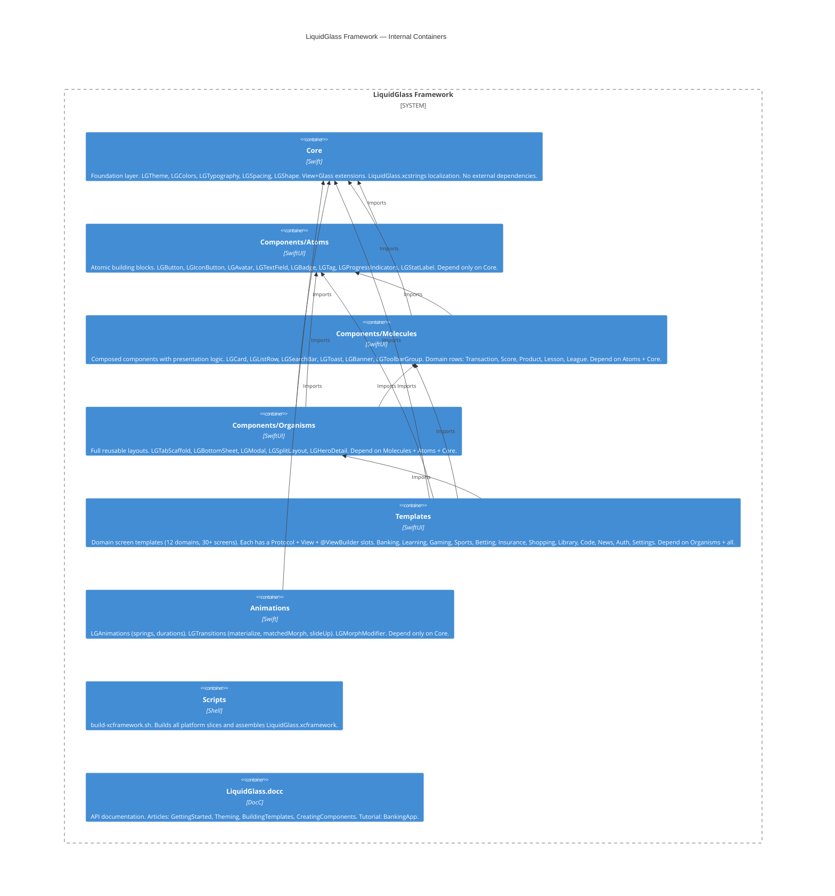

# C4 Level 2 — Container Diagram

## Dependency rules
- Core has zero inward dependencies. It is the foundation.
- Atoms → Core only.
- Molecules → Atoms + Core.
- Organisms → Molecules + Atoms + Core.
- Templates → everything below. Never import other Templates.
- Animations → Core only.
- Scripts and Docs have no Swift dependencies.
