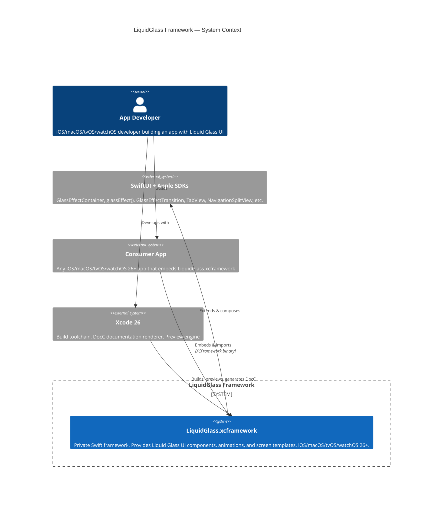

# C4 Level 1 — Context Diagram

## Description
The developer builds a consumer app that embeds the `LiquidGlass.xcframework` binary. The framework is built on top of SwiftUI and Apple's Liquid Glass APIs. The developer uses Xcode 26 to build, preview components, and browse the DocC documentation catalog.
