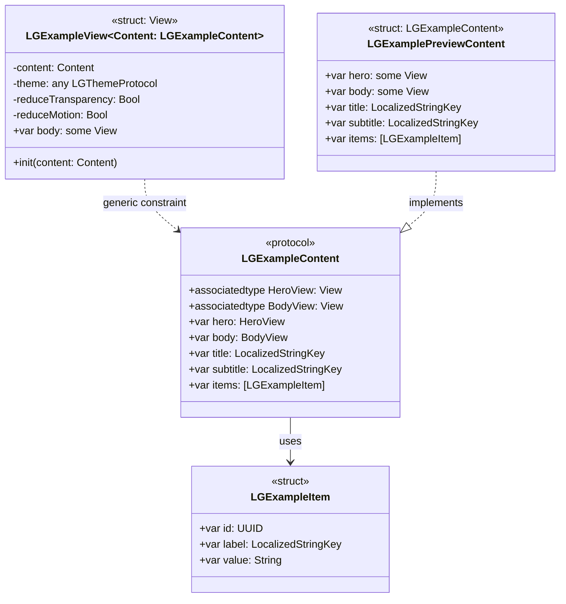

# Template Structure — Protocol → View → Slots Pattern



## Pattern rules
1. **Protocol** (`LGXContent`) defines what the consumer must provide: typed `@ViewBuilder` slots + data properties.
2. **View** (`LGXView<Content>`) is generic over `Content`. It reads `@Environment(\.lgTheme)`, `reduceTransparency`, and `reduceMotion`.
3. **Preview content** (`LGXPreviewContent`) implements the protocol with realistic mock data. It lives in the same file.
4. The consumer creates their own `Content` struct that conforms to `LGXContent` and passes it to `LGXView(content:)`.

## Theme flow inside a Template
```
App root
  └── .lgTheme(MyCustomTheme())
        └── LGBankingDashboardView(content: myContent)
              └── @Environment(\.lgTheme) → lgTheme
                    ├── LGCard → reads lgTheme.colors.surface
                    ├── LGButton → reads lgTheme.colors.primary
                    └── LGStatLabel → reads lgTheme.typography.display
```
