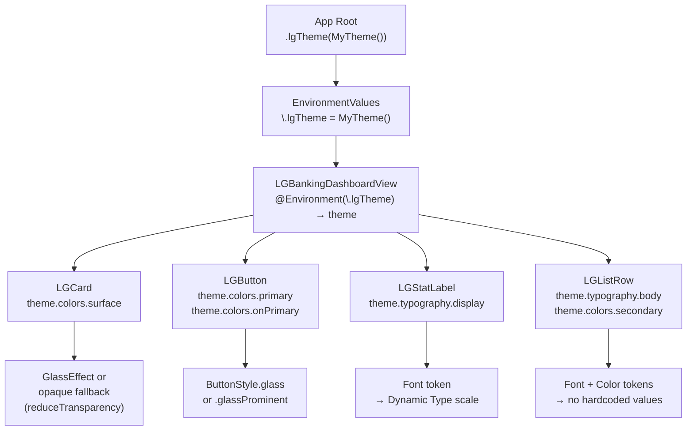
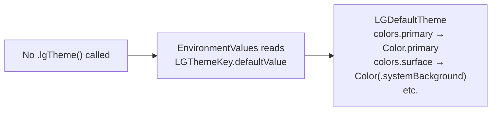

# Theme Injection Flow



## Default Theme fallback
If the consumer does **not** call `.lgTheme(_:)`, `LGThemeKey.defaultValue` is used — `LGDefaultTheme`. It maps all color tokens to SwiftUI semantic colors (`.primary`, `.secondary`, `.background`, etc.) so the framework works out of the box with any color scheme.



## Consumer custom theme
```swift
struct MyBankingTheme: LGThemeProtocol {
    var colors: LGColorTokens {
        LGColorTokens(
            primary: Color("BrandBlue"),
            secondary: Color("BrandSlate"),
            surface: Color("CardBackground"),
            accent: Color("BrandGold"),
            destructive: Color("AlertRed"),
            onPrimary: .white,
            onSurface: Color("TextPrimary")
        )
    }
    var typography: LGTypographyTokens {
        LGTypographyTokens(
            display: .custom("Montserrat-Bold", relativeTo: .largeTitle),
            headline: .custom("Montserrat-SemiBold", relativeTo: .headline),
            body: .custom("Montserrat-Regular", relativeTo: .body),
            caption: .custom("Montserrat-Regular", relativeTo: .caption)
        )
    }
}
```
